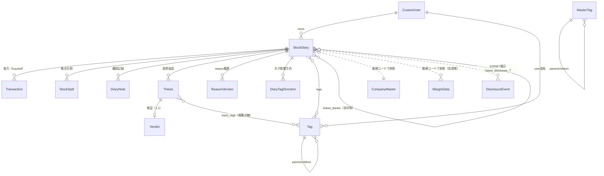

# オントロジー（カブログの概念モデル）

Stock-Dialy（カブログ）が扱うドメイン概念（エンティティ）と、その**意味・関係・不変条件**を
1箇所に定義する。コードの `models.py` は「構造の正本」、本書は「**意味の正本**」。
「何を表すのか」「どの概念と混同してはいけないか」を確定させ、AI・人間のどちらが触っても
概念を取り違えないようにする。

- 指標（的中/勝ち/象限）の意味定義 → `stockdiary/services/metrics.py`（セマンティックレイヤー）。
  `Verdict`・`karte_service`・`views_growth`・`views.py`（的中判定）から実際に呼ばれる**稼働中**の層。
- 集計の不変条件 → `CLAUDE.md`「AggregateService」節
- 成長OSの設計思想 → `docs/growth_os_redesign.md`
- 分析API・テンプレ運用 → `CLAUDE.md`「Claude Code 分析連携」／`docs/analysis_templates/`

---

## 1. 全体像



**中心は `StockDiary`。** ユーザー×銘柄で1レコード。取引・記録・仮説・タグがぶら下がり、
保有数や損益などの**集計値は StockDiary 自身が保持**する（オンザフライ計算ではなく、
`Transaction`/`StockSplit` の変更時に `AggregateService` がゼロから再計算する派生値）。

---

## 2. エンティティ辞書

### CustomUser（`users`）
メール認証・Google OAuth のカスタムユーザー。すべての `StockDiary`・`Tag` の所有者。

### StockDiary（中心モデル）
「ユーザーがある銘柄について、なぜ投資したか・取引・振り返りを記録する単位」。
ユーザー×銘柄で1レコード（同一銘柄の複数売買ラウンドも1日記に集約される）。

| フィールド | 意味 |
|-----------|------|
| `stock_symbol` / `stock_name` / `sector` / `currency` | 銘柄同定 |
| `reason`（label=背景, API=`investment_reason`） | **企業説明**（企業の俯瞰）。`企業説明テンプレート.md`で書く。⚠️「買った理由」とは限らない（→§3） |
| `current_quantity` ほか集計群 | 現物＋信用の**合算**の派生集計（保有数・平均取得単価・実現損益等） |
| `cash_only_*` | 現物のみの集計（信用を除いた実像） |
| `first_purchase_date` / `last_transaction_date` | 初回購入・最終取引 |
| `latest_disclosure_date` / `latest_disclosure_doc_type_name` | EDINETから定期更新される最新開示 |
| `is_excluded` | 集計・分析対象から除外するフラグ |

**状態（派生）**: `is_holding`＝`current_quantity>0`（保有中）／`is_sold`＝取引ありで保有0（売却済み）／
`is_memo`＝取引なし（メモ）／`current_quantity<0`＝信用売り建て（ショート）。

### Transaction
日記に紐づく1回の売買。`transaction_type`＝`buy`（購入）/`sell`（売却）、`price`・`quantity`・
`is_margin`（信用フラグ）・`transaction_date`。**FIFOで損益を積む一次事実**。
`save()`/`delete()` が `diary.update_aggregates()` を内部で呼ぶ（→§5不変条件）。

### StockSplit
株式分割の記録。`split_date`・`split_ratio`（例 4.0=4:1）・`is_applied`。
適用すると過去の取得単価・数量が遡及調整される。**未登録だと現在値（分割後）と
取得単価（分割前）が食い違い、含み損益が壊れる**（実例: CRWDの4:1未登録で-49.6%誤表示→補正後+101%）。

### DiaryNote（継続記録）
保有中〜売却後の時系列の追記。`note_type`＝analysis/news/earnings/insight/risk/retrospective/other、
`topic`（例 `決算分析`・`ポジション判定`）。同一テーマを1スレッドに束ねる。決算分析・
ポジション判定はここに `topic` を明示して書く。

### Thesis（投資仮説）＝「買った理由」の構造化
`reason`（企業説明）とは別に、**答え合わせ可能な主張**を構造で持つ。成長OS検証ループの起点。

| フィールド | 意味 |
|-----------|------|
| `claim` | 主張（この投資で賭けている命題） |
| `basis` / `basis_tags` | 根拠（文章／軸タグ） |
| `worst_case` | **これが起きたら仮説は崩れる条件**（＝損切り/縮小の起点） |
| `horizon` / `review_due_date` | 想定検証期間／検証予定日（ホーム想起のトリガー。`is_due`） |
| `status` | open（未検証）/ verified（検証済み）/ abandoned（取り下げ） |

### Verdict（検証）
`Thesis` に1:1。**意思決定の質と損益を分離**して記録する。
`hypothesis_result`（hit/partial/miss/unknown）×`pnl_result`（profit/loss/flat/holding）で
2×2象限（skill/unlucky/lucky/discipline）に分類。`decision_quality`(1–5)・`learning`（学びの原子）。
「仮説◯×損失」「仮説×××利益」を一級市民にするのが本質。定義の正本は `metrics.py`。

### ReasonVersion
`reason` の変更履歴スナップショット。`update_reason` 時に旧内容を自動退避。

### Tag / MasterTag / DiaryTagDirection（`tags`）
- **Tag**: ユーザー固有のタグ。`axis`（theme/business_model/risk/capital_policy/macro/event/custom）で
  分類、`parent`で親子階層、`df`＝そのタグが付いた銘柄数（出現頻度）。日記の関連図の軸になる。
- **MasterTag**: 全ユーザー共通の**タグ正本候補**（`tag_master.md`が正本テキスト）。`@タグ`保存時の
  軸決定・補完候補に使う。`axis!=custom`にするとスコアリング対象になる。
- **DiaryTagDirection**: 「この日記にとってこのタグは↑/↓/→どの影響か」。マクロ感応の向き
  （例 `@円安↑`）を日記単位で持つ。

### linked_diaries（関連日記・非対称M2M）
A→B と B→A は独立（`symmetrical=False`）。決算分析の「関連銘柄への波及」等で銘柄間を結び、
関連図を作る。

### MarginData（`margin_tracking`）
JPX週次の信用取引残高（銘柄コード×`record_date`）。`margin_ratio`＝買い残/売り残。
1倍未満＝売り長（取組良好）、高倍率・買い残増＝将来の戻り売り圧力（上値の重し）。
StockDiaryとはFKでなく**銘柄コードで疎結合**（外国株はデータなし）。

### CompanyMaster（`company_master`）／EDINET開示（`earnings_analysis`）
- **CompanyMaster**: 銘柄・企業マスタ。
- **DisclosureEvent / EarningsSchedule / DocumentMetadata**: EDINET/TDnetの開示・決算日程。
  `DisclosureSync` が同期し、`StockDiary.latest_disclosure_*` に反映（想起機能の基盤）。
  ※ copomo（CopoMoスタンドアロンUI）は本ツールの機能開発対象外だが、この開示データ層は本体扱い。

---

## 3. 意味論的な区別（混同禁止の概念対）

このアプリの肝。**同じ語で語ってはいけない**対を明示する。

| 区別すべき対 | 違い |
|-------------|------|
| **`reason`（企業説明）** ≠ **`Thesis`（買った理由/仮説）** | reasonは`企業説明テンプレート`で書く企業の俯瞰。買い判断・崩れる条件は入るとは限らない。エントリー仮説・worst_caseは`Thesis`にある。ポジション判定は`theses`を主ソースにする |
| **意思決定の質（Verdict）** ≠ **損益（realized_profit）** | Verdictの「勝ち」は仮説の当否ベース。tagsの勝率は実現損益ベース。別の指標。混ぜない（`metrics.py`冒頭） |
| **保有している（`current_quantity>0`）** ≠ **持ち続ける是非** | 前者は事実（判定の入口）。後者は仮説がまだ有効かで決まる |
| **合算集計（`current_quantity`等）** ≠ **現物のみ（`cash_only_*`）** | 前者は現物＋信用。信用を除いた実像は後者 |
| **Tag（ユーザー固有）** ≠ **MasterTag（正本候補）** | 個人の実タグ vs 全体で選べるタグの母集団 |
| **集計値（派生）** ≠ **一次事実（Transaction/StockSplit）** | 集計は取引から都度再計算される派生。手で書き換えない |

---

## 4. 状態・ライフサイクルと成長OSループ

**日記の状態**: メモ（取引なし）→ 保有中（`current_quantity>0`）→ 売却済み（保有0・取引あり）。

> **稼働状況**: 成長OSループ（Thesis→Verdict→カルテ→metrics診断）は**実運用されている**。
> 2026-07時点で `Thesis` は約116件蓄積、保有31銘柄中8銘柄に仮説・5銘柄がopen仮説、
> `Verdict`（検証済み）付きの仮説も複数ある。metrics.py 由来の得意/苦手診断は実データで動く。
> （設計思想 → `docs/growth_os_redesign.md`）

**仮説の検証ループ（成長OSの心臓）**:
```
Thesis(claim/worst_case) ──review_due_date到来(is_due)──▶ ホーム想起（答え合わせ待ち）
        │                                                        │
        └──────────── 結果（損益） ──── Verdict（仮説の当否 × 損益）───┘
                                              │
                            2×2象限 ─ skill/unlucky/lucky/discipline ─▶ 学び（learning）
```
- 象限: `skill`（仮説◯×利益＝再現せよ）/`unlucky`（仮説◯×損失）/`lucky`（仮説×××利益＝危険）/
  `discipline`（仮説×××損失＝想定通り）。
- 閾値（得意/苦手/偶然の勝ち警告 等）も `metrics.py` が正本。

---

## 5. 集計の不変条件（AggregateService）

`StockDiary` の集計値は、取引の変更後に**必ず1回だけ**再計算される（構造で保証）。

- **単体操作 → 自動**: `Transaction.save()`/`delete()` が `diary.update_aggregates()` を呼ぶ。
- **一括操作 → `AggregateService.deferred(diary)` で囲む**: `bulk_create`等は`save()`を経ないため、
  このブロックで囲む。抜けると1回だけ再集計。
- FIFO損益は `stockdiary/services/aggregate_service.py`。現物と信用は別フィールド（`cash_only_*`）で追跡。

詳細は `CLAUDE.md`「AggregateService — 集計の不変条件」。
